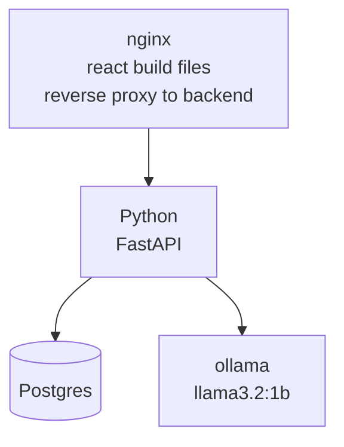

# Phonebook with LLM integration

This project offers traditional crud operations for contacts as well 
as natural language processing capabilities. Check [youtube video](https://youtu.be/fceY1n-L0Ds?si=At07O2vmqb4Hi_6y)
where I show its functionality.

The project is built using 
- Python with FastAPI for backend 
- Postgres as a database
- sqlalchemy as ORM and alembic for migrations(will be run automatically on container start)
- llama3.2:1b model inside ollama container
- React for frontend.
- nginx for reverse proxy and serving build frontend files

Docker composition is used to run the project. 

Note that LLM is run in docker container as well hence 
its performance depends greatly on your machine's performance. I recommend at least 6GB of RAM to run the project.

## Project architecture

## How to run the project
1. Clone the repository
2. Create .env file based on `.env.example`
3. Run `docker compose up -d --build`
4. Open [http://localhost:8888](http://localhost:8888) in your browser
5. OpenAPI documentation is available at [http://localhost:8888/docs](http://localhost:8888/docs)

## Walkthrough video

